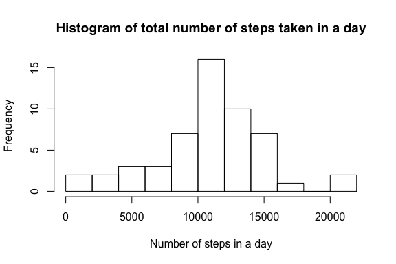
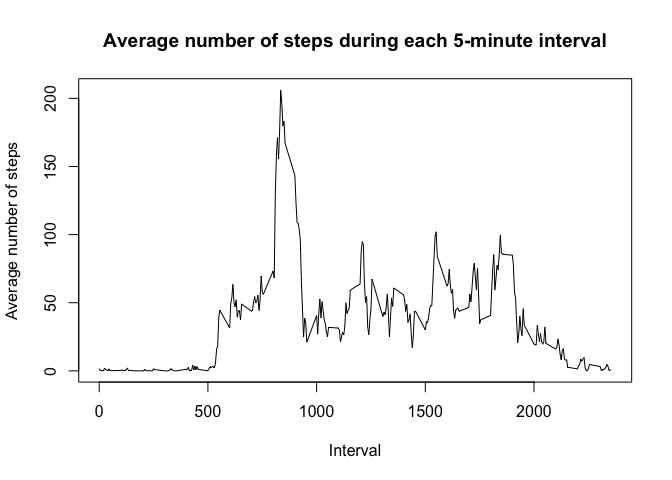
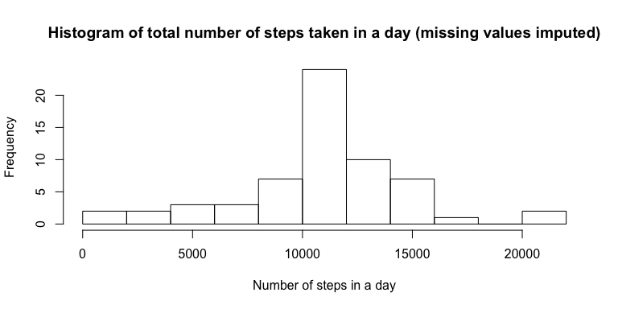

## Loading and preprocessing the data
#### 1. Load the data (i.e. read.csv())
The activity data file is unzipped if it hasn't been already.

```r
filename <- "activity.zip"
dataFile <- "activity.csv"
if(!file.exists(dataFile)) {
    unzip(filename)
}
```
The data file is read into variable `activity`.

```r
activity <- read.csv(dataFile)
str(activity)
```

```
## 'data.frame':	17568 obs. of  3 variables:
##  $ steps   : int  NA NA NA NA NA NA NA NA NA NA ...
##  $ date    : Factor w/ 61 levels "2012-10-01","2012-10-02",..: 1 1 1 1 1 1 1 1 1 1 ...
##  $ interval: int  0 5 10 15 20 25 30 35 40 45 ...
```

## What is mean total number of steps taken per day?
The dplyr package is loaded. It will be used to process the activity data.

```r
library(dplyr)
```

#### 1. Calculate the total steps per day.
Using the dplyr package, the data is first grouped by day and then the total number of steps per day is calculated. 

```r
total_daily_steps <- activity %>%
    group_by(date) %>%
    summarize(total_steps = sum(steps))
head(total_daily_steps)
```

```
## # A tibble: 6 x 2
##   date       total_steps
##   <fct>            <int>
## 1 2012-10-01          NA
## 2 2012-10-02         126
## 3 2012-10-03       11352
## 4 2012-10-04       12116
## 5 2012-10-05       13294
## 6 2012-10-06       15420
```

#### 2. Create a histogram of total number of steps taken each day.
A histogram plot is generated using the total daily steps calculated in the previous step.

```r
hist(total_daily_steps$total_steps,
     breaks=10,
     main="Histogram of total number of steps taken in a day",
     xlab="Number of steps in a day")
```

<!-- -->

#### 3. Calculate the mean and median number of steps taken per day.
When calculating the mean and median number of steps taken per day, remove missing values and round to the nearest integer.

```r
mean_steps <- mean(total_daily_steps$total_steps, na.rm=TRUE)
print(mean_steps)
```

```
## [1] 10766.19
```

```r
median_steps <- median(total_daily_steps$total_steps, na.rm=TRUE)
print(median_steps)
```

```
## [1] 10765
```

## What is the average daily activity pattern?
#### 1. Make a time series plot (i.e. type="l") of the 5-minute interval (x-axis) and the average number of steps taken, averaged across all days (y-axis)
Using the dplyr package, the data is first grouped by 5-minute inverval and then the average number of steps across all days is calculated. 

```r
average_interval_steps <- activity %>%
    group_by(interval) %>%
    summarize(average_steps = mean(steps, na.rm=TRUE))
head(average_interval_steps)
```

```
## # A tibble: 6 x 2
##   interval average_steps
##      <int>         <dbl>
## 1        0        1.72  
## 2        5        0.340 
## 3       10        0.132 
## 4       15        0.151 
## 5       20        0.0755
## 6       25        2.09
```

A time-series plot is generated using this data.

```r
with(average_interval_steps,
     plot(interval, average_steps,
          type="l",
          main="Average number of steps during each 5-minute interval",
          xlab="Interval", ylab="Average number of steps")
)
```

<!-- -->

#### 2. Which 5-minute interval, on average across all the days in the dataset, contains the maximum number of steps?
The interval with the maximum number of steps is calculated:

```r
interval_max_steps <- which.max(average_interval_steps$average_steps)
print(interval_max_steps)
```

```
## [1] 104
```
    
## Imputing missing values
#### 1. Calculate and report the total number of missing values in the dataset (i.e. the total number of rows with NAs)


```r
num_missing_values <- sum(is.na(activity$steps))
print(num_missing_values)
```

```
## [1] 2304
```

#### 2. Devise a strategy for filling in all of the missing values in the dataset. The strategy does not need to be sophisticated. For example, you could use the mean/median for that day, or the mean for that 5-minute interval, etc.

Here we will identify the indexes which correspond to missing values, find the corresponding interval value, and then construct a replacement vector with the average step value across all days for the given interval value.

```r
index_nas <- is.na(activity$steps)
intervals_nas <- activity$interval[index_nas]
lookup_average_steps <- function(i) {
    a <- average_interval_steps %>% filter(interval == i)
    a$average_steps
}
replacements <- sapply(intervals_nas, lookup_average_steps)
```
    
#### 3. Create a new dataset that is equal to the original dataset but with the missing data filled in.

```r
activity_filled <- activity
activity_filled$steps[index_nas] <- replacements
```

#### 4. Make a histogram of the total number of steps taken each day and calculate and report the mean and median total number of steps taken per day. Do these values differ from the estimates from the first part of the assignment? What is the impact of imputing missing data on the estimates of the total daily number of steps?


```r
total_daily_steps_filled <- activity_filled %>%
    group_by(date) %>%
    summarize(total_steps = sum(steps))

hist(total_daily_steps_filled$total_steps,
     breaks=10,
     main="Histogram of total number of steps taken in a day (missing values imputed)",
     xlab="Number of steps in a day")
```

<!-- -->

```r
mean_steps_filled <- mean(total_daily_steps_filled$total_steps)
print(mean_steps_filled)
```

```
## [1] 10766.19
```

```r
median_steps_filled <- median(total_daily_steps_filled$total_steps)
print(median_steps_filled)
```

```
## [1] 10766.19
```
It is evident that imputing the missing values by replacing them with the average value step value across all days for a given interval causes little effect on the mean and median value for the data, and the histogram remains very similar.

## Are there differences in activity patterns between weekdays and weekends?

#### 1. Create a new factor variable in the dataset with two levels – “weekday” and “weekend” indicating whether a given date is a weekday or weekend day.

```r
activity_filled$day_type <- weekdays(as.Date(activity_filled$date))
activity_filled$day_type <- ifelse(activity_filled$day_type %in% c("Saturday","Sunday"), "weekend", "weekday")
activity_filled$day_type <- as.factor(activity_filled$day_type)
```

#### 2. Make a panel plot containing a time series plot (i.e. type="l") of the 5-minute interval (x-axis) and the average number of steps taken, averaged across all weekday days or weekend days (y-axis). See the README file in the GitHub repository to see an example of what this plot should look like using simulated data.


```r
activity_filled_day_type <- activity_filled %>%
    group_by(interval, day_type) %>%
    summarize(average_steps = mean(steps))

library(lattice)
xyplot(average_steps ~ interval | day_type, activity_filled_day_type, type="l", layout=c(1,2),
       xlab="Interval", ylab="Number of steps")
```

<!-- -->

